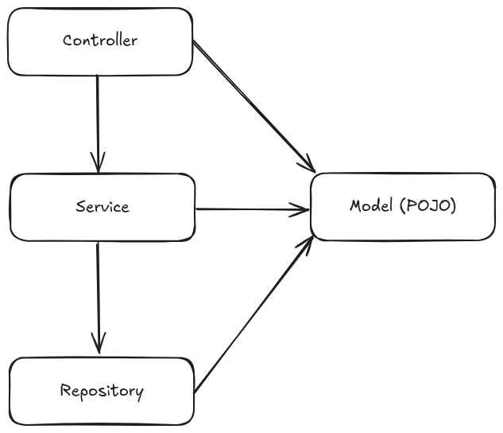

# SpringBootHibernate

Projeto de exemplo utilizando Spring Boot, Hibernate (JPA) e PostgreSQL para persistência de dados.

## Descrição
Este projeto demonstra a criação de uma API REST para cadastro e consulta de carros e seus respectivos donos. Utiliza as melhores práticas de organização de pacotes, integração com Hibernate, e mapeamento de entidades com relacionamento 1:N (um dono pode ter vários carros, mas um carro só tem um dono).

## Tecnologias Utilizadas
- Java 17+
- Spring Boot
- Spring Data JPA (Hibernate)
- PostgreSQL
- Maven

## Estrutura de Pacotes
- `controller`: Endpoints REST da aplicação
- `service`: Regras de negócio e integração com repositórios
- `model`: Entidades JPA (Carro, Dono)
- `repository`: Interfaces de acesso ao banco de dados

## Funcionalidades
- Cadastro de carros e donos
- Consulta de todos os carros
- Consulta de carro por id
- Consulta de carro por nome
- Consulta de carros de um dono
- Relacionamento entre carro e dono

## Configuração
1. Configure o banco de dados PostgreSQL e ajuste o arquivo `src/main/resources/application.properties` com suas credenciais.
2. Execute o projeto com `./mvnw spring-boot:run` ou via sua IDE.

## Exemplo de Endpoints
- `GET /carros` — Lista todos os carros
- `GET /carros/{id}` — Busca carro por id
- `GET /carros/buscar?nome=Fusca` — Busca carro por nome

## Diagrama

*(Adicione a imagem do diagrama na pasta docs e atualize o caminho acima)*

## Observações
- O projeto utiliza anotações do Jackson para evitar referência cíclica na serialização das entidades.
- O método `toString()` da entidade Carro exibe os dados do carro e do dono.

## Autor
Jorge Luiz

---

Para dúvidas ou sugestões, abra uma issue ou entre em contato.

